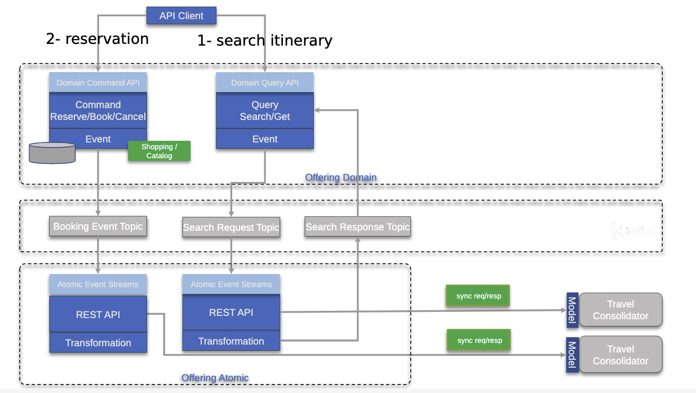

# Travelport Event-Driven Microservice practices

This site shares some best practices to adopt cloud native, event-driven microservice implementation with Kafka, CI/CD pipeline, Spring Boot Cloud Stream, and API management.

The simple solution presents the following components:

## Repositories part of the proof of technology

* 
* 

## API management