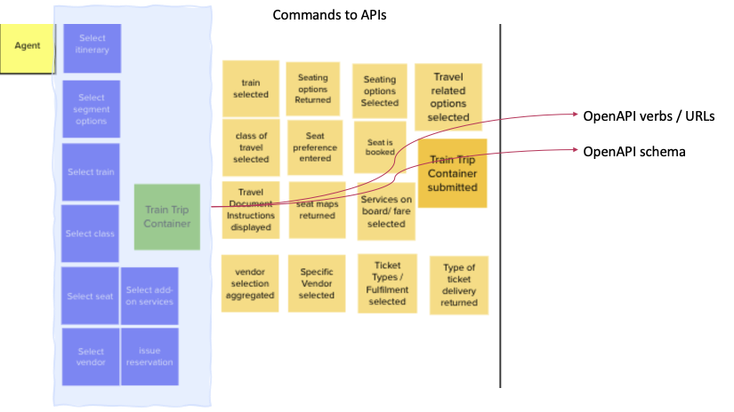
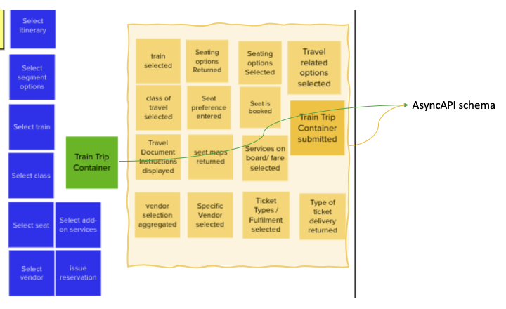
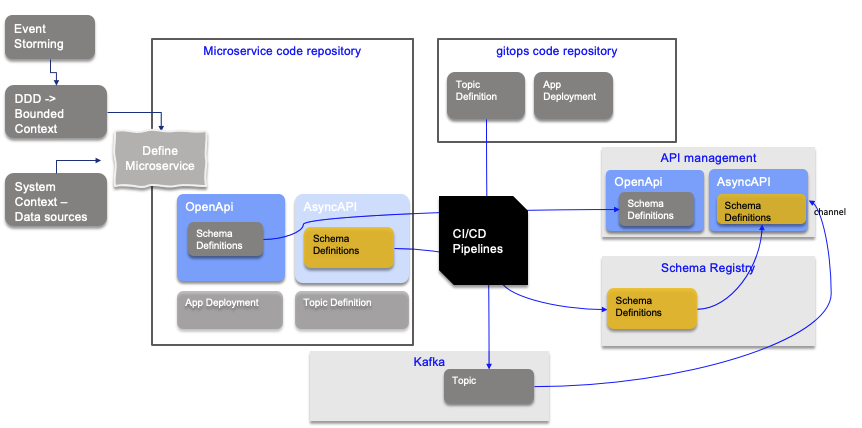

# Methodology

In this project we have covered some event storming and domain driven design practices. 
You will find our working content on [event storming in our public github](https://ibm-cloud-architecture.github.io/refarch-eda/methodology/event-storming/) with also [domain driven design](https://ibm-cloud-architecture.github.io/refarch-eda/methodology/domain-driven-design/) and some documented examples like the [vaccine solution design thinking and event storming workshop report](https://ibm-cloud-architecture.github.io/vaccine-solution-main/design/dtw/) add the [DDD applied](https://ibm-cloud-architecture.github.io/vaccine-solution-main/design/ddd/) to this use case.

We also quickly reviewed the developer experience and link to the methodology. In the next section we describe in more detail the potential practices, you could adopt in the future.

## Getting developer on board

The first question is how to relate the artifacts discovered and analyzed during the domain driven design workshops to API, event, schema...

So the OpenAPI document will most likely integrate verbs supporting the 'blue stickers'. With OpenAPI 3.0 specification the schema can be separated, so schema definition can be done in separate documentation.

As an implementation approach we can use OpenAPI editor to design the beginning of the API specifications from the discovered commands, and entities, aggregates and value objects.

For the events discovered, we can develop JSON schema to at least cover all the event definitions and then incrementally add attributes to them.

It is important to use an iterative approach to define such schema. Once a first, good enough, version is defined we can start to deloy to a schema registry.

The asyncAPI could be developed top-down (See [api management section](/patterns/api_mgt/#async-api)) or discovered once Kafka Topic is defined. 

If we consider developer's artifacts, we can see that most of the bounded contexts will lead to at least one microservice. 
Then within each microservice git repository, developer can start developing:

* OpenAPI definitions started by an architect or lead developer during the analyzis of the DDD commands and aggregates
* Event schemas and asyncAPI.
* Code
* Application deployment manifests for Kubernetes
* Topic definition for which this repository has ownership. (For example the entity managed by this microservice could define topic(s) to produce facts about this entity)

Adopting a git action pipeline and a gitops repository, the topic definition and application manifests will evolve to be part of this gitops repository.

Once APIs reach a suffisant level of maturity they can be uploaded to an API management tool to support subscription and deployment to gateway.

Schema definitions are also published to schema registry which are used by Kafka based solution.

CI/CD pipelines can automate this deployment process.

This figure above presents the concepts of the elements to consider as part of the methodology. But if we think in term of production and development environments, things may differ.

For development or testing environment, schema registry is mandatory so the Gitops needs to provision it and upload any schemas.

For production environment the API management becomes mandatory and APIs need to be uploaded to start managing their subscriptions.