# Modernization of the API Lifecycle

This page summarizes some of the best practices for introducing API management in development practices and architecture patterns within an enterprise setting.

## Moving from a Pure API Gateway to an API Management system

An API Gateway helps provide security, control, integration, and optimized access to a full range of mobile, web, application programming interface (API), service-oriented architecture (SOA), B2B and cloud workloads. A gateway is used in the following patterns:

* As a **Security Gateway**, placed between the consumer facing firewall and the system of records facing firewall (DMZ). It is used for both policy enforcement and consistent security policies across business channels.
<br/>
* As an **API Gateway**, both as an internal and external gateway, with centralized service governance and policy enforcement, and with traffic monitoring.
<br/>
* To provide **connectivity (HTTP) and mediation (XML, JSON) services** in the internal network, close to the system of record. 

API management gives enterprises greater flexibility when reusing the functionality of API integrations and helps save time and money without trading off security. An API Management system supports a broader scope of features for API lifecycle management, including: 

* API lifecycle management to activate, retire, or stage an API product.
* API governance with security, access, and versioning.
* Analytics, dashboards, third party data offload for usage analysis.
* API socialization based on a portal that allows self-service and discovery for the developer community.
* An API developer toolkit to facilitate the creation and testing of APIs.

### Classical pain points

Some of the familiar pain points that indicate it is time to consider adopting a broader API management product include:

* Current API details like endpoints, request/response message format, error conditions, test messages, and SLAs are not easily available or not well documented.
* Difficult to tell which subscribers are really using the API and how often, without building a custom solution.
* Difficult to differentiate between business-critical subscribers versus low value subscribers.
* Managing different lines of business and organizations is complex.
* No dynamic scaling built into the solution, which often means making hardware investments for maximum load or worst availability scenarios.
* Difficult to evolve the APIs, such as moving from SOAP based web services to RESTful services to GraphQL
* No support for AsynchAPI to automate and formalize the documentation or code generation of any event-driven APIs.
* The need to ensure consistent security rules
* Integrating CI/CD pipelines with the API lifecycle

## Enterprise APIs across boundaries

If you consider a typical API management product, it includes a set of components as presented in the figure below that could be deployed on-premise on a Kubernetes-based platform or on several Cloud provider regions. APIs served by different applications or microservices can be deployed in multiple regions but still be managed by one central API management server.

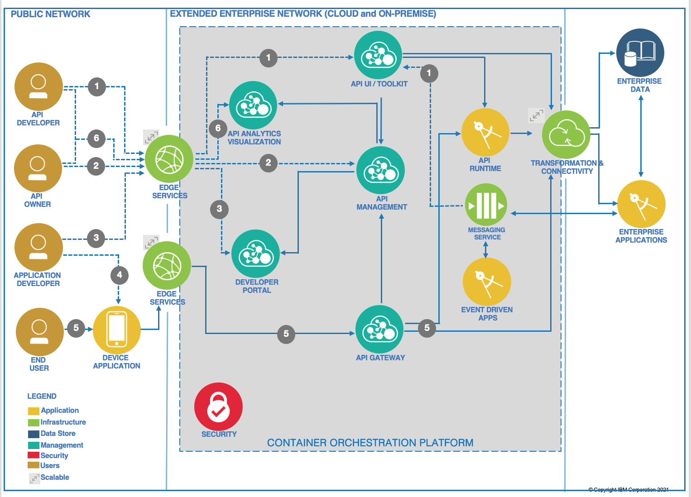

Here is how it works:

1. An API developer signs on to the API management cloud services account and accesses the API developer User interface or CLI toolkit. The developer creates the synch API and implements business logic. He maps and integrates the API data model to the back-end schema through the transformation and connectivity service. He tests and deploys the API to the runtime and publishes to API management. He can also create Async APIs from a messaging system by binding channels to topics or queues and define the message payload.
<br/>
1. The API Product Manager or API owner signs on to the API management cloud services account and accesses the API management component. She includes the sync API endpoint to existing API products, and plans and specifies access controls. She publishes the API to the developer portal for external discovery by application developers.
<br/>
1. An application developer accesses the developer portal and uses search to discover any available APIs.
<br/>
1. The application developer uses the API in an application and deploys that application to the device.
<br/>
1. The device user opens the application that issues the API request. The request is handled by the API gateway, which performs load balancing and security validation for all API requests. The API gateway validates access policies with API management and invokes the API. The API polyglot runtime executes the API and obtains the data payload from the backend. The API response is sent back to the API gateway. Alternatively, APIs exposed by enterprise applications can be executed on that enterprise application runtime. The API gateway forwards the response to the calling application. The API gateway reports usage metrics and analytics to the API management system.
<br/>
1. API developers and API owners can log on to the API analytics visualization component to view dashboards on API usage metrics and other analytics.
<br/>
For Travelport, a deployment across cloud providers could look like the diagram below, using API Connect in CP4I:


On the left side (green boxes), the consumers of the API register to a Developer portal to get all the metadata about the API they want to consume. They register their applications as API subscribers. Their applications can run on the cloud or on-premise. 

For Travelport's Rail Services, the API Gateway services would be colocated with the target Rail Services to reduce latency. These would be deployed as <em>StatefulSet</em> on an OpenShift cluster, which means as a set of pods with consistent <em>identities</em>. Identities are defined as:
- <b>Network</b>: A single stable DNS and hostname.
- <b>Storage</b>: As many VolumeClaims as requested.
The StatefulSet guarantees that a given network identity will always map to the same storage identity. 

The API Gateway acts as a reverse proxy, and exposes the `Booking APIs`, enforcing user authentication and security policies, and handling traffic monitoring, rate limiting, and statistics. The API Gateway can also perform transformations and aggregate various services to fulfill a request. 

The Developer Portals can be separated, or centralized depending on API characteristics exposed from different clouds (for example different Developer Portals for internal and external APIs). In the example above, the portal is deployed on the Cloud Provider as a container inside an OpenShift cluster. The Analytic service is also a StatefulSet and gets metrics from the gateway.

Rail services for Travelport are accessing remote consolidators and this traffic can also go to the API gateway. Those services will also integrate with existing backend services running on-premise, whether they are deployed or not on OpenShift. 

The management service for the API management product is running on-premise in the diagram above to illustrate that it is a central deployment to manage multiple gateways.

Gateway services, Developer Portal services, and Analytics services are scoped to a single region, unlike the Management System, which can communicate across availability zones.

The different API management services run on OpenShift which can help ensure high availability of each of the components. 

### Open API (Swagger)

Within the API Management system, the OpenAPI document can be created top-down with a Swagger UI or bottom up using Annotation in the Java JAXRS resource classes. Either way, the API can be uploaded to the API management product.

The important parts are to define the operations exposed and the request / response structure of the data model. 

### Async API
Cloud Pak for Integration (CP4I) 2021.1, which includes APIC V10, also supports the Async API specification. AsyncAPI is an open source initiative that focuses on making Event-Driven Architectures (EDAs) as easy to work with as REST APIs.

The AsyncAPI specification (currently at 2.0.0) establishes standards for events and EDAs, covering everything "from documentation to code generation, and  from discovery to event management" (asyncapi.com/docs). <br/>
The goal is to enable the creation of better tooling in the message-driven space, better governance of asynchronous APIs, and standardization in documentation for asynchronous APIs. In short, Async API is to Message-driven architectures what OpenAPI is to REST APIs. While OpenAPI is the recommended practice for RESTful APIs, adopting AsyncAPI is the recommended practice for event-driven APIs.

An AsyncAPI document is a file in either YAML or JSON format that defines and annotates the different components of an event-driven API. For example, AsyncAPI can formally describe how to connect to a Kafka cluster, the details of the Kafka topics (channels in AsyncAPI), and the type of data in messages. AsyncAPI includes both formal schema definitions and space for free-text descriptions (https://dalelane.co.uk/blog/?p=4219).

Here is what it looks like: 

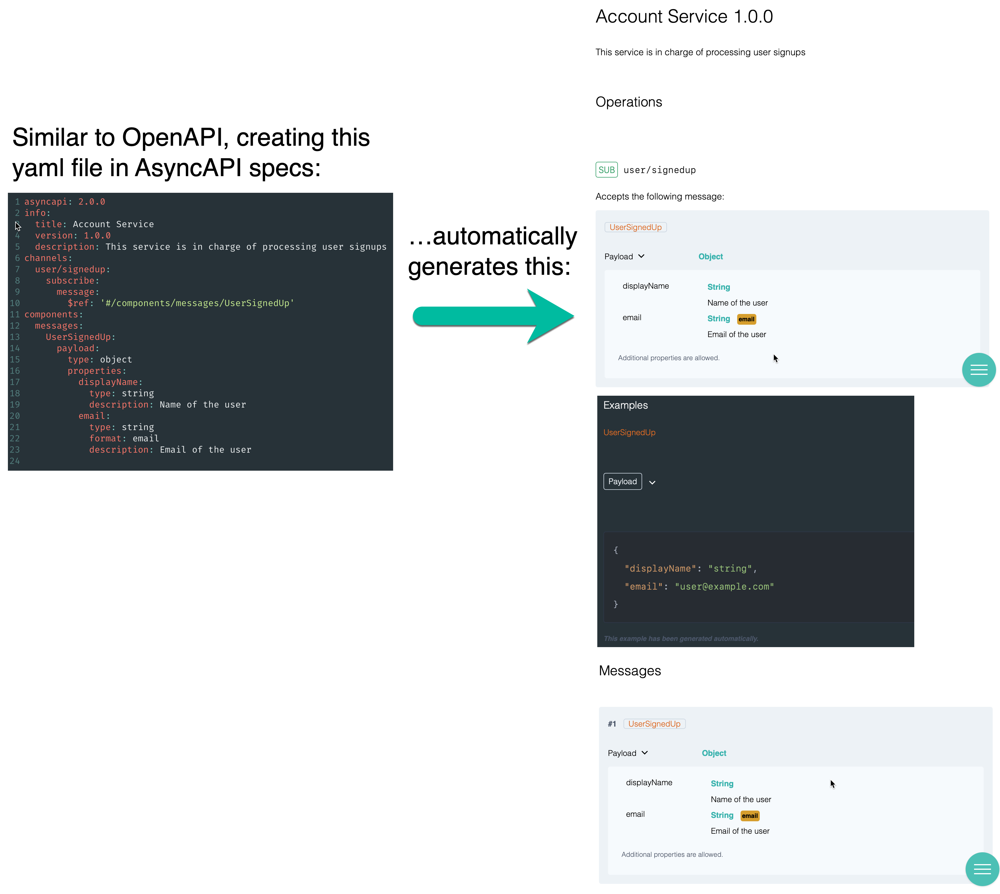

You may have noticed the similarties with OpenAPI. That is because AsyncAPI was initially an adaptation of OpenAPI, which as part of its scope does not include support for the Message Queuing Telemetry Transport (MQTT) and the Advanced Message Queuing Protocol (AMQP). 

The creator of the AsyncAPI specification, Fran Méndez, describes what he did at first with just OpenAPI to make up for the lack of MQTT and AMQP support: paths were AMQP topics, GET was SUBSCRIBE, and POST was PUBLISH--and ugly hack at best, which forced him to write additonal code to support the necessary EDA-based documentation and code generation.

Many companies use OpenAPI, but in real-world situations, including that of Travelport, systems need formalized documentation and code generation support for both REST APIs <em>and</em> events. 

Here are the structural differences between OpenAPI and AsyncAPI:

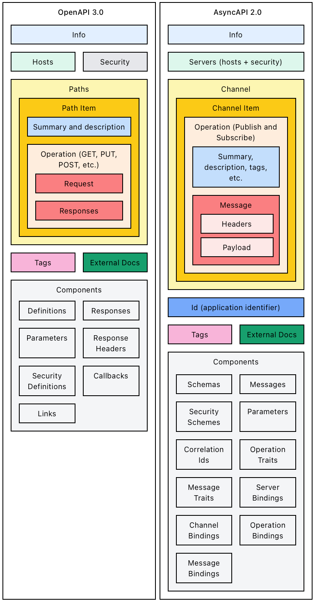

Source: https://www.asyncapi.com/docs/getting-started/coming-from-openapi

A few things to note include:
* AsyncAPI is compatible with OpenAPI schemas, which is quite useful since many times the information flowing in the events is very similar to the one the REST APIs have to handle in requests and responses.
* The message payload in AsyncAPI does not have to be an AsyncAPI/OpenAPI schema; it can be any value such as an Apache Avro schema, which is considered to be one of the better choices for stream data, where data is modeled as streams (see <em>Why Avro for Kafka</em> below). 
* The AsyncAPI server object is almost identical to its OpenAPI counterpart with the exception that <em>scheme</em> has been renamed to <em>protocol</em> and AsyncAPI introduces a new property called <em>protocolVersion</em>.
* AsyncAPI channel parameters are the equivalent of OpenAPI path parameters, except that AsyncAPI does not have the notion of <em>query</em> and <em>cookie</em>, and header parameters can be defined in the message object. 

### Describing Kafka with AsyncAPI
This section summarizes how to use AsyncAPI from the perspective of a Kafka user, as described [here](https://dalelane.co.uk/blog/?p=4219) by Dale Lane.

First, there are some minor differences in terminology between Kafka and AsyncAPI that you should note: 
#### Comparing Kafka and AsyncAPI Terminology

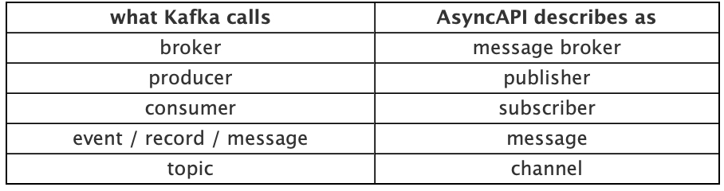

#### The AsyncAPI Document
Considering the structure in the diagram above, let's look at some of the parts of an AsyncAPI document:
##### Info
The Info section has three parts which represent the minimum required information about the application: <em>title</em>, <em>version</em>, and <em>description</em> (optional), used as follows:

```
asyncapi: 2.0.0
...
info:
  title: Account Service
  version: 1.0.0
  description: This service is in charge of processing user signups
```
The description field you can include markdown for rich-text formatting.

##### Id
The Id is the application identifier. It can be a URN (recommended) or URL. The important thing is that it must be a unique ID for your document. Here is an example:
```
asyncapi: '2.0.0'
...
id: 'urn:uk:co:andrewdoransmith:apimgmtdemo:railevents'
...
```

##### Servers
The servers section allows you to add and define which servers client applications can connect to for sending and receiving messages (for example, this could be a list of server objects, each uniquely identifying a Kafka broker).

 Here is an example, where you have three Kafka brokers in the same cluster:
```
servers:
  broker1:
    url: andy-broker-0:9092
    protocol: kafka
    protocolVersion: '1.0.0'
    description: This is the first broker
  broker2:
    url: andy-broker-1:9092
    protocol: kafka
    protocolVersion: '1.0.0'
    description: This is the second broker
  broker3:
    url: andy-broker-2:9092
    protocol: kafka
    protocolVersion: '1.0.0'
    description: This is the third broker
```

The example above uses the ```kafka``` protocol for the different brokers, which is a popular protocol for streaming solutions, but the protocol can be any. For example, the most common protocols include: ```mqtt```, which is widely adopted by the Internet of Things and mobile apps, ```amqp```, which is popular for its reliable queueing, ```ws``` for WebSockets, frequently used in browsers, and ```http```, which is used in HTTP streaming APIs.

> #### Difference Between the AMQP and MQTT Protocols
> <b>AMQP</b> was mainly popularized by RabbitMQ. It provides reliable queuing, topic-based publish-and-subscribe messaging, flexible routing, transactions, and security. The main reasons to use AMQP are reliability and interoperability. AMQP exchanges route messages directly—in fanout form, by topic, and also based on headers.
> 
> <b>MQTT</b> The design principles and aims of MQTT are much more simple and focused than those of AMQP—it provides publish-and-subscribe messaging (no queues, in spite of the name) and was specifically designed for resource-constrained devices and low bandwidth, high latency networks such as dial up lines and satellite links, for example. Basically, it can be used effectively in embedded systems.

When using a <em>broker-centric</em> architecture such as Kafka or RabbitMQ, you normally specify the URL of the broker. For more classic client-server models, such as REST APIs, your server should be the URL of the server.

One limitation in AsyncAPI documents is that you cannot include multiple Kafka clusters (such as a production cluster and clusters for dev, test, and staging environments) in a single document.

One workaround is to list all brokers for all clusters in the same document, and then rely on the description or extension fields to explain which ones are in which cluster. This is, however, not recommended because it could interfere with code  generators or other parts of the AsyncAPI ecosystem which may consider them as all being members of one large cluster.

So, as a best practice, avoid this workaround and stick to one cluster per AsyncAPI document.

> <b>NOTE</b>: As with OpenAPI, you can add additional attributes to the spec using the x- prefix, which identifies an entry as your own extension to AsyncAPI.

##### Security
If the Kafka cluster doesn’t have auth enabled, the protocol used should be ```kafka```. Otherwise, if client applications are required to provide credentials, then the protocol should be ```kafka-secure```. 

To identify the type of credentials, add a security section to the server object. The value you put in there is the name of a securityScheme object you define in the components section.

The types of security scheme that you can specify aren’t Kafka-specific. Choose the value that describes your type of approach to security.

For example, if you’re using SASL/SCRAM, which is a username/password-based approach to auth, you could describe this as ```userPassword```. Here is an example:

```
asyncapi: 2.0.0
...
servers:
  broker1:
    url: localhost:9092
    description: Production server
    protocol: kafka-secure
    protocolVersion: '1.0.0'
    security:
    - saslScramCreds: []
...
components:
  securitySchemes:
    saslScramCreds:
      type: userPassword
      description: Info about how/where to get credentials
      x-mykafka-sasl-mechanism: 'SCRAM-SHA-256'
view raw
```
The description field allows you to explain the security options that Kafka clients need to use. You could also use an extension (with the -x prefix).


##### Channels
All brokers support communication through multiple channels (known as <em>topics</em>, <em>event types</em>, <em>routing keys</em>, <em>event names</em> or other terms depending on the system). Channels are assigned a name or identifier.

The channels section of the specification stores all of the mediums where messages flow through. Here is a simple example:

```
channels:
  hello:
    publish:
      message:
        payload:
          type: string
          pattern: '^hello .+$'
```

In this example, you only have one channel called hello, and an app would subscribe to this channel to receive hello {name} messages. Notice that the payload object defines how the message must be structured. In this example, the message must be of type string and match the regular expression ```'^hello .+$'``` in the format hello {name} string.

Each topic (or channel) identifies the operations that you want to describe in the spec. Here is another example:

```
asyncapi: '2.0.0'
...
channels:
  my.topic.name:
    description: This is my Kafka topic
    subscribe:
      operationId: someUniqueId
      summary: Interesting messages
      description: You can get really interesting messages from this topic
      tags:
      - name: awesome
      - name: interesting
      ...
```
For each operation, you can provide a unique id, a short one-line text summary, and a more detailed description in plain text or markdown formatting.

##### Bindings
AsyncAPI puts protocol-specific values in sections called bindings.

The bindings sections allows you to specify the values that Kafka clients should use to perform the operation. The values you can describe here include the consumer group id and the client id.

If there are expectations about the format of these values, then you can describe those by using regular expressions. Here is an example:

```
asyncapi: '2.0.0'
...
channels:
  my.topic.name:
    description: This is my Kafka topic
    subscribe:
      ...
      bindings:
        kafka:
          groupId: 
            type: string
            pattern: '^[A-Z]{10}[0-5]$'
          clientId:
            type: string
            pattern: '^[a-z]{22}$'
          bindingVersion: '0.1.0'
```
You can instead specify a discrete set of values, in the form of enumerations:
```
asyncapi: '2.0.0'
...
channels:
  my.topic.name:
    description: This is my Kafka topic
    subscribe:
      ...
      bindings:
        kafka:
          groupId: 
            type: string
            enum:
            - validone
            - validtwo
          clientId:
            type: string
            enum:
            - validoption
          bindingVersion: '0.1.0'
view raw
```
##### Messages
A message is how information is exchanged via a channel between servers and applications. According to the specifications, a message MUST contain a payload and MAY also contain headers. The headers MAY be subdivided into protocol-defined headers and header properties defined by the application which can act as supporting metadata. The payload contains the data, defined by the application, which MUST be serialized into a format (JSON, XML, Avro, binary, etc.). Because a message is a generic mechanism, it can support multiple interaction patterns such as event, command, request, or response.

As with all the other levels of the spec, you can provide background and narrative in a description field for the message:
```
asyncapi: '2.0.0'
...
channels:
  my.topic.name:
    ...
    subscribe:
      ...
      message:
        description: Description of a single message
```

###Summary
The following diagram summarizes the sections described above:
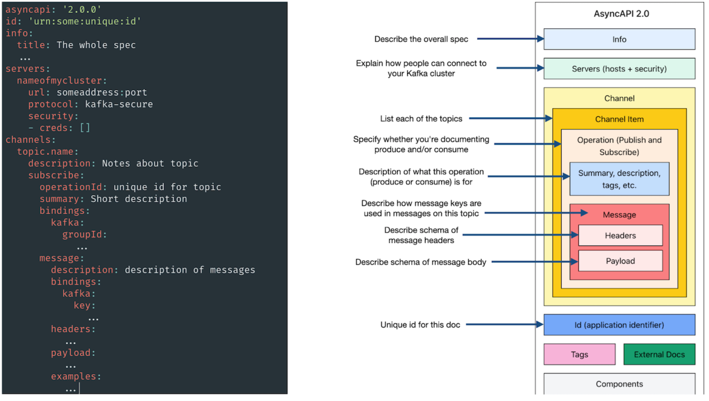
For more information, the official AsyncAPI specifications can be found [here](https://www.asyncapi.com/docs/specifications/2.0.0).

### Why Avro for Kafka?
Apache Avro is "an open source data serialization system that helps with data exchange between systems, programming languages, and processing frameworks" (https://www.confluent.io/blog/avro-kafka-data/). The following features make Avro a great fit for stream data:

* Direct mapping to and from JSON, but typically much faster than JSON, with much smaller encodings
* Compact format, making it more efficient for high-volume usage
* Bindings for a wide variety of programming languages
* A rich, extensible schema language defined in pure JSON


### Travelport API Management Demo
With respect to API Management, there are three main areas of interest to Travelport:
* Version Control
* API Documentation & Discovery
* Redirecting to different APIs

Besides a new, event-driven approach to its API model, Travelport needs a way to securely provide self-service access to different versions of its APIs, to enable their developers to discover and easily use these APIs, and to be able to redirect API calls based on several criteria.

IBM API Connect (APIC) is a complete and scalable API platform that allows them to do these things, in addition to exposing, managing, and monetizing APIs across clouds. API Connect is also available with other capabilities as an IBM Cloud Pak® solution.

#### API Manager
You manage your APIs by using the API Manager user interface of IBM® API Connect. The API Manager UI allows you to manage private internal APIs as well as public external APIs. API Manager is an on-premises offering that provides the capabilities required to externalize and manage your services as REST or SOAP APIs.


#### Create Capability
Travelport can leverage API Connect's <b>Create</b> capability, powered by the Open Source Loopback framework, to build APIs with a built-in Swagger (OpenAPI) editor or using a simple guided model-driven approach. APIC allows developers to create a new API from scratch or an API based on the schema of an existing data source, such as a database.

[NEED SCREEN CAPTURE, PREFERABLY FROM DEMO HERE]

#### Explore Capability
Travelport developers can use API Connect's <b>Explore</b> capability to quickly examine their new APIs and try their operations. 

[NEED SCREEN CAPTURE, PREFERABLY FROM DEMO HERE]

#### Developers
Developers can add their APIs to the API Connect server and have the choice of running them on the cloud or on-premise, as mentioned above. This can be done through API Connect's UI or with the provided CLI. 

Developers and Administrators can then connect to the API Connect Server and see their running APIs, including those that were created as well as those that were added based on existing data sources. 

[NEED SCREEN CAPTURE, PREFERABLY FROM DEMO HERE]

## Developer Experience

### Developer Portal
The Developer Portal is a convenient place to share APIs with application developers. After a Developer Portal has been enabled through the API Manager, and one or more API Products have been published, application developers 
can browse and use the APIs from the Developer Portal dashboard, as shown below:

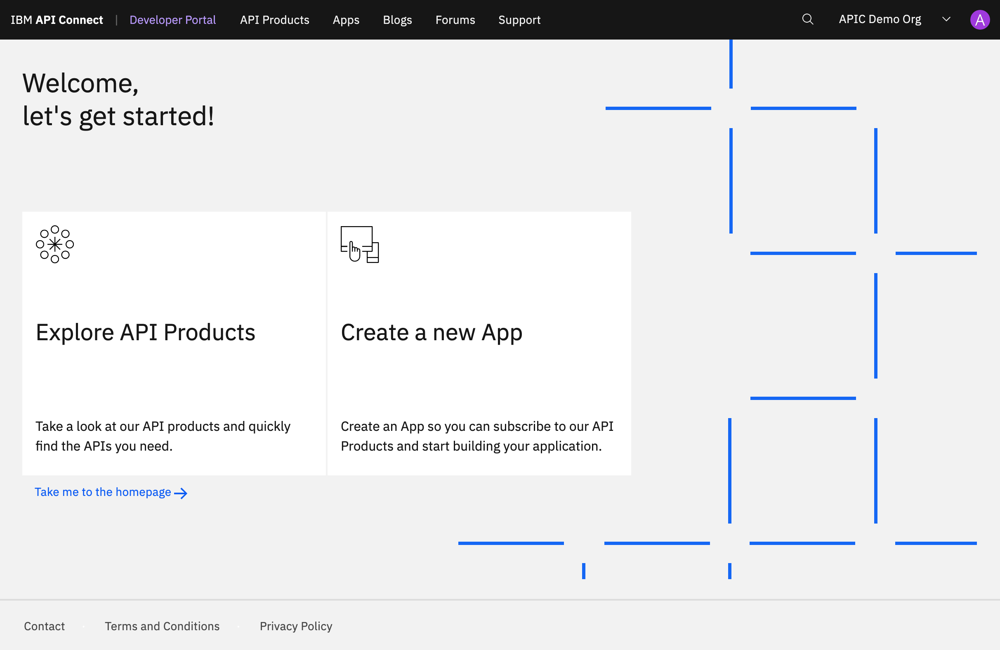


The Developer Portal can be used as is when it is first enabled, or it can be customized to fit the corporate branding and design requirements of a particular organization. You can configure the Developer Portal for test and development purposes, or for internal use only.

#### Subscribing to an API in the Developer Portal

To subscribe to an API, from the Developer Portal, the develper clicks ```API Products``` to find and subscribe to any available APIs:

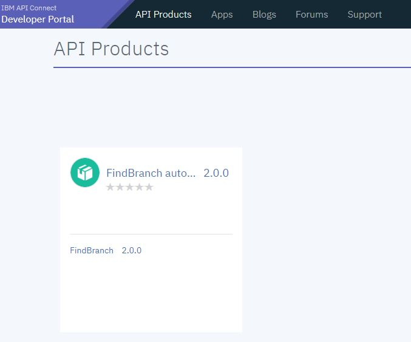

In this case, an API called <em>FindBranch</em> Version 2.0, which is contained in the <em>FindBranch Auto Products</em> product is available. Clicking ```Subscribe``` enables the developer to use the API:

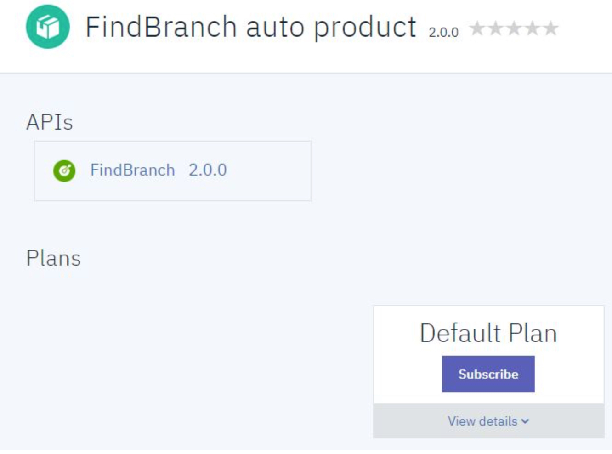

Under the Application heading, the developer can click ```Select App``` for the new application:

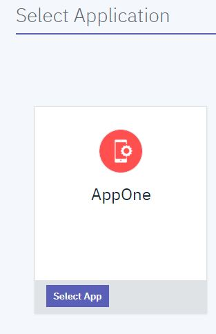

From the next screen below, the developer can click Next:

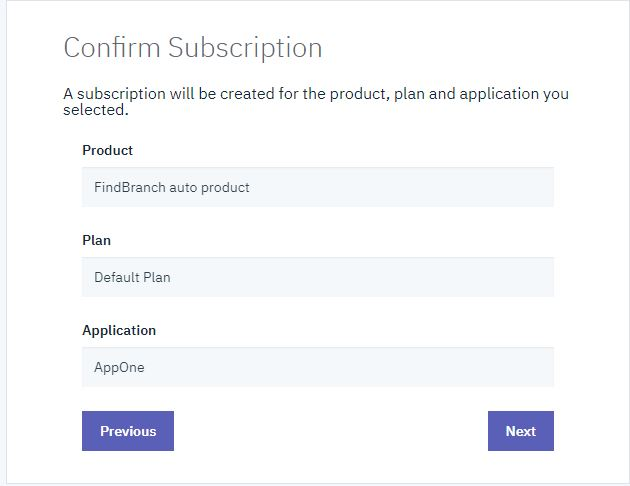

Doing this shows the screen below, confirming to the devleoper that his or her applicatin is now subscribed to the selected API under the selected plan. Pressing ```Done``` in the next screen completes the subscription.

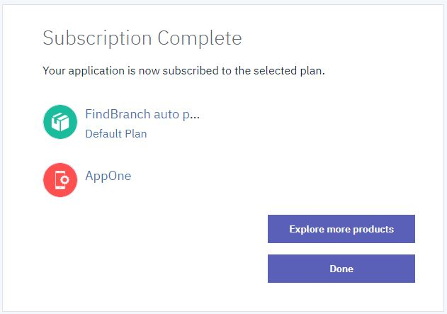


#### Testing An API in the Developer Portal
To test an API, the developer clicks ```API Products``` in the Developer Portal dashboard to show all available products:

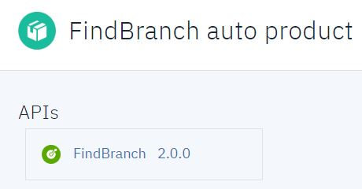

Clicking a product, such as FindBranch auto product, for example, and then clicking the FindBranch API from the provided list shows the available API operations. 

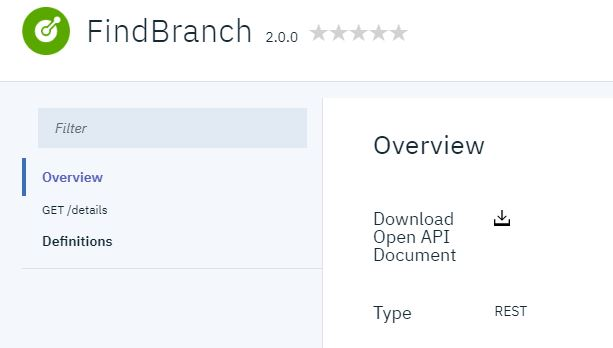

The developer can click ```GET/details```, for instance, to see the details of the GET operation: 

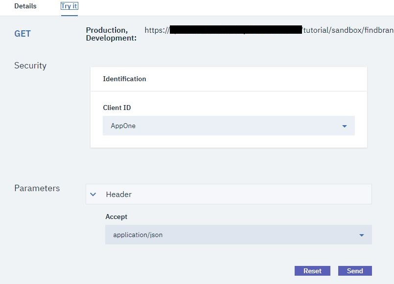

Clicking the ```Try it``` tab and pressing ```Send``` allows the developer to test the API to better understand how it works:

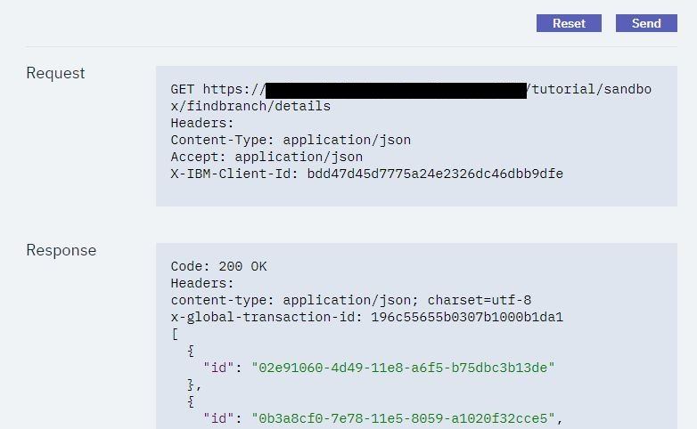

As you can see above, this shows the request/response from invoking the API. API Connect shows a returned response of 200 OK and the message body, indicating that the REST API operation call was successful.

#### API Product Managers
Administrators or API Product Managers can make changes such as adding corporate security polices or transformations before publishing the APIs. They can also control the visibility and define the rate limit for the APIs. 

[NEED SCREEN CAPTURE, PREFERABLY FROM DEMO HERE]

#### Redirecting to Different APIs
API Product Managers can also create policies to redirect...

[NEED SCREEN CAPTURE, PREFERABLY FROM DEMO HERE]

Once the APIs are ready, API Product Managers can expose them for developer consumption and self-service in Travelport's Developer Portal. Developers who have signed up can discover and use any APIs which Travelport has exposed. 

Because the APIs were documented while they were being created using OpenAPI notation, developers cannot only view the APIs but also try them out. API Connect provides source code examples in several different languages that show how to use the API operations. Languages supported include Curl, Ruby, Python, Java, Go, and Node.js.

[NEED SCREEN CAPTURE, PREFERABLY FROM DEMO HERE]

#### Version Control


[NEED SCREEN CAPTURE, PREFERABLY FROM DEMO HERE]


## Further Readings

* [IBM Redbook on Agile Integration](https://www.redbooks.ibm.com/abstracts/sg248452.html)
* [A Demo of Event Endpoint Management - Cloud Pak for Integration](https://community.ibm.com/community/user/integration/blogs/dale-lane1/2021/04/12/a-demo-of-event-endpoint-management])
