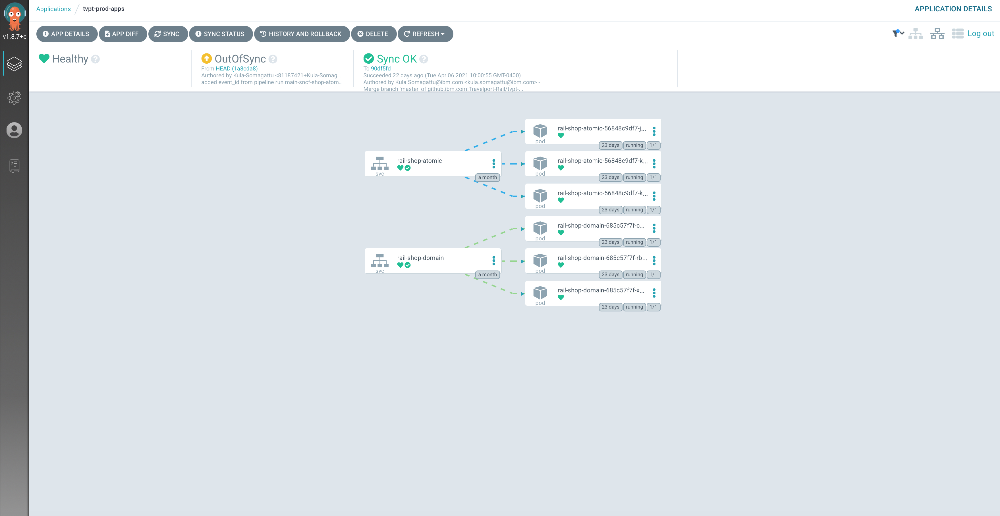

# CI/CD Practices

## Continuous Delivery Practices

With IBM® Cloud Continuous Delivery, you can build, test, and deliver applications by using DevOps or DevSecOps practices and industry-leading tools. Continuous Delivery supports a wide variety of practices. There is no one-size-fits-all answer. The practices you employ can vary from one software delivery project to the next. The IBM® Cloud Garage Method is the IBM approach to rapidly deliver engaging applications. It combines continuous delivery with IBM Design Thinking, lean startup methodology, DevOps, and agile practices. 
Those practices are focused on the cloud native, but can benefit any software development effort.

## OpenShift Pipelines

OpenShift Pipelines is a Continuous Integration / Continuous Delivery (CI/CD) solution based on the open source Tekton project. 
In the OpenShift platform, the Open Source Tekton project is known as <em>OpenShift Pipelines</em>, so both terms are often used interchangeably. 

The key objective of Tekton is to enable development teams to quickly create pipelines of activity from simple, repeatable steps. 
A unique characteristic of Tekton that differentiates it from previous CI/CD solutions is that Tekton steps execute within a container that is specifically created just for that task.

Users can interact with OpenShift Pipelines using the web user interface, command line interface, and via a Visual Studio Code editor plugin. The command line access is a mixture of the OpenShift ‘oc’ command line utility 
and the ‘tkn’ command line for specific Tekton commands. The <b>tkn</b> and <b>oc</b> command line utilities can be downloaded from the OpenShift console web user interface. To do this, simply press the white circle containing 
a black question mark near your name on the top right corner and then select Command Line Tools:


## Cluster

For the Rail project demo, we created a cluster in the IBM Cloud called <em>tvpt-rail-dev</em>, as follows:


## Pipelines Used in This Project

We also created the following pipeline (labelled <em>ci-pipeline</em>) within the namespace <em>tvpt-pipelines</em>:


The idea is to build an application from source code using Maven and the OpenShift Source to Image (S2I) process. 

The steps in the pipeline we created are as follows:

* <b>git-status-pending</b> which tells Git that we are starting the build.
* <b>clone-source-repo</b> which clones the repository
* <b>maven-package</b> which does the Maven build.
* <b>image-build-and-push</b> which is a Docker image build and push operation
* <b>git-kustomize-app</b> is a custom step that takes all the changes from the build (e.g. new image, tags, properties, config maps, sealed secrets, updates, etc.) and anything that needs to be pushed to the Argo repo for Argo to deploy.
* <b>argo-sync-health-check</b> Once the pipeline pushes everything to the Argo repo in the previous step, this step deploys it to (syncs with) the cluster, and reports status back from Argo saying that everyting has been deployed and the health of the application is good.
* <b>newman-integration-test</b> This step starts the integration tests using the Postman collection.
* <b>git-status-complete </b>Finally, this completion task sends status back to Git saying that the build is completed. 

### Use of Persistent Storage

We also added persistent storage for the pipeline, in our case called <em>pipeline-storage-claim</em>:


Having persistent storage allows us to cache and manage state between tasks in the pipeline. For example, for its build, Maven needs all the repositories from the project dependencies. 
Having persistent storage allows us to maintain a cache of those repositories so that we don't have to download them every time we build. 

<!-- * From one step to another step in the pipeline. Each task is its own pod. A cloned step will do a git pull, but when moving to the next step, <em><b>you lose that???</b></em>, so this allows us to pass the workspace between the tasks. </em> -->

Since each step runs in an isolated container any data that is created by a step for use by another step must be stored appropriately. If the data is accessed by a subsequent step within the same task then it is possible to use the /workspace directory to hold any created files and directories. A further option for steps within the same task is to use an emptyDir storage mechanism which can be useful for separating different data content for ease of use. If file stored data is to be accessed by a subsequent step that is in a different task, then a Kubernetes persistent volume claim is required to be used.
The mechanism for adding storage to a step is called a <em>volumeMount</em>, as described further below. 

In our case, a persistent volume claim called <em>pipeline-storage-claim</em> is mounted into the step at a specifc path. Other steps within the task and within other tasks of the pipeline can also mount this volume and reuse any data placed there by this step. Note that the path used is where the Buildah command expects to find a local image repository. As a result any steps that invoke a Buildah command will mount this volume at this location.

><b>Buildah</b> is a tool that facilitates building Open Container Initiative (OCI) container images. The Buildah package provides a command line tool that can be used to create a container from scratch or using an image as a starting point.

### When to use persistent storage: 
* Your data must still be available, even if the container, the worker node, or the cluster is removed. You should use persistent storage in the following scenarios:
    * Stateful apps
    * Core business data
    * Data that must be available due to legal requirements, such as a defined retention period
    * Auditing
    * Data that must be accessed and shared across app instances. For example: 
       - <b>Access across pods</b>: When you use Kubernetes persistent volumes to access your storage, you can determine the number of pods that can mount the volume at the same time. Some storage solutions, such as block storage, can be accessed by one pod at a time only. With other storage solutions, you can share volume across multiple pods.
       - <b>Access across zones and regions</b>: You might require your data to be accessible across zones or regions. Some storage solutions, such as file and block storage, are data center-specific and cannot be shared across zones in a multizone cluster setup.

### Pipeline Listener
Our pipeline listener, <em>el-ci-event-listener</em>, exposes the endpoints for triggering pipeline execution from a webhook:


### Tasks
The fundamental resource of the Tekton process is the <em>task</em>, which contains at least one step to be executed and performs a useful function. Tasks are normally organized into an ordered execution set using a pipeline resource.

<!-- Tasks execute steps in the order in which they are written, with each step completing before the next step starts. -->

Pipelines execute tasks in parallel unless a task is directed to run after the completion of another task. This facilitates parallel execution of build / test / deploy activities and is a useful characteristic that guides the user in the grouping of steps within tasks.

These are the reusable tasks we have created for the Travelport demo:


### Structure of a Pipeline

A <em>pipelineRun</em> resource invokes the execution of a pipeline. This allows specific properties and resources to be used as inputs to the pipeline process, such that the steps within the tasks are configured for the requirements of the user or environment. Here is the breakdown of the parts that make up a pipeline run: 


The <em>pipelineRun</em> invokes the pipeline, which contains tasks. Each task consists of a number of steps, each of which can contain elements such as command, script, volumeMounts, workingDir, parameters, resources, workspace, or image. 

#### command

The command element specifies the command to be executed, which can be a sequence of a command and arguments.

#### script

Alternatively, you can use a script which can be useful if a single step is required to perform a number of command line operations. 

Below is an example from the Travelport demo that uses a script (for the mvn-settings task) and a command (for the mvn-goals task). These two tasks make up the maven-package step, responsible for the maven build:

```yaml
steps:
    - image: 'registry.access.redhat.com/ubi8/ubi-minimal:latest'
      name: mvn-settings
      resources: {}
      script: >
        #!/usr/bin/env bash

        [[ -f $(workspaces.maven-settings.path)/settings.xml ]] && \

        echo 'using existing $(workspaces.maven-settings.path)/settings.xml' &&
        exit 0

        cat > $(workspaces.maven-settings.path)/settings.xml <<EOF

        <settings>
          <mirrors>
            <!-- The mirrors added here are generated from environment variables. Don't change. -->
            <!-- ### mirrors from ENV ### -->
          </mirrors>
          <proxies>
            <!-- The proxies added here are generated from environment variables. Don't change. -->
            <!-- ### HTTP proxy from ENV ### -->
          </proxies>
        </settings>

        EOF


        xml=""

        if [ -n "$(params.PROXY_HOST)" -a -n "$(params.PROXY_PORT)" ]; then
          xml="<proxy>\
            <id>genproxy</id>\
            <active>true</active>\
            <protocol>$(params.PROXY_PROTOCOL)</protocol>\
            <host>$(params.PROXY_HOST)</host>\
            <port>$(params.PROXY_PORT)</port>"
          if [ -n "$(params.PROXY_USER)" -a -n "$(params.PROXY_PASSWORD)" ]; then
            xml="$xml\
                <username>$(params.PROXY_USER)</username>\
                <password>$(params.PROXY_PASSWORD)</password>"
          fi
          if [ -n "$(params.PROXY_NON_PROXY_HOSTS)" ]; then
            xml="$xml\
                <nonProxyHosts>$(params.PROXY_NON_PROXY_HOSTS)</nonProxyHosts>"
          fi
          xml="$xml\
              </proxy>"
          sed -i "s|<!-- ### HTTP proxy from ENV ### -->|$xml|" $(workspaces.maven-settings.path)/settings.xml
        fi


        if [ -n "$(params.MAVEN_MIRROR_URL)" ]; then
          xml="    <mirror>\
            <id>mirror.default</id>\
            <url>$(params.MAVEN_MIRROR_URL)</url>\
            <mirrorOf>central</mirrorOf>\
          </mirror>"
          sed -i "s|<!-- ### mirrors from ENV ### -->|$xml|" $(workspaces.maven-settings.path)/settings.xml
        fi
      securityContext:
        privileged: true
    - args:
        - '-s'
        - $(workspaces.maven-settings.path)/settings.xml
        - $(params.GOALS)
      command:
        - /usr/bin/mvn
      image: $(params.MAVEN_IMAGE)
      name: mvn-goals
      resources: {}
      securityContext:
        privileged: true
      workingDir: $(workspaces.source.path)/$(params.SUB_PATH)
```

#### volumeMounts

volumeMounts allow you to add storage to a step. Since each step runs in an isolated container, any data that is created by a step for use by another step must be stored appropriately. 
If the data is accessed by a subsequent step within the same task then it is possible to use the `/workspace` directory to hold any created files and directories. 
A further option for steps within the same task is to use an emptyDir storage mechanism which can be useful for separating out different data content for ease of use. If file stored data is to be accessed by a subsequent step that is in a different task then a Kubernetes persistent volume claim is required to be used. As explained below, this is what we do for the Travelport demo.

Note that volumes are defined in a section of the task outside the scope of any steps, and then each step that needs the volume will mount it. 

#### workingDir

The `workingDir` element refers to the path within the container that should be the current working directory when the command is executed.

#### parameters

As with volumeMounts, parameters are defined outside the scope of any step within a task and then they are referenced from within the step. Parameters in this case refers to any information in text form required by a step such as a path, a name of an object, a username etc.  The example below shows the parameters used in the Buildah task, which builds source into a container image and then pushes it to a container registry:

```yaml
params:
    - description: Reference of the image buildah will produce.
      name: IMAGE
      type: string
    - default: 'quay.io/buildah/stable:v1.17.0'
      description: The location of the buildah builder image.
      name: BUILDER_IMAGE
      type: string
    - default: overlay
      description: Set buildah storage driver
      name: STORAGE_DRIVER
      type: string
    - default: ./Dockerfile
      description: Path to the Dockerfile to build.
      name: DOCKERFILE
      type: string
    - default: .
      description: Path to the directory to use as context.
      name: CONTEXT
      type: string
    - default: 'true'
      description: >-
        Verify the TLS on the registry endpoint (for push/pull to a non-TLS
        registry)
      name: TLSVERIFY
      type: string
    - default: oci
      description: 'The format of the built container, oci or docker'
      name: FORMAT
      type: string
    - default: ''
      description: Extra parameters passed for the build command when building images.
      name: BUILD_EXTRA_ARGS
      type: string
    - default: ''
      description: Extra parameters passed for the push command when pushing images.
      name: PUSH_EXTRA_ARGS
      type: string
    - default: ''
      description: subpath for build artifacts.
      name: SUB_PATH
      type: string
```

#### resources

A reference to the resource is declared within the task and then the steps use the resources in commands. A resource can be used as an output in a step within the task.

In Tekton, there is no explicit Git pull command. Simply including a Git resource in a task definition will result in a Git pull action taking place, before any steps execute, which will pull the content of the Git repository to a location of `/workspace/<git-resource-name>`. 
In the example below the Git repository content is pulled to `/workspace/source`.

```yaml
kind: Task
 resources:
   inputs:
     - name: source
       type: git
   outputs:
     - name: intermediate-image
       type: image
 steps :
   - name: build
     command:
       - buildah
       - bud
       - '-t'
       - $(resources.outputs.intermediate-image.url)
```

Resources may reference either an image or a Git repository and the resource entity is defined in a separate YAML file. 
Image resources may be defined as either input or output resources depending on whether an existing image is to be consumed by a step
 or whether the image is to be created by a step.

#### workspace

A workspace is similar to a volume in that it provides storage that can be shared across multiple tasks. A persistent volume claim 
is required to be created first and then the intent to use the volume is declared within the pipeline and task before mapping the 
workspace into an individual step such that it is mounted. Workspaces and volumes are similar in behavior but are defined in
 slightly different places.

#### Image

Since each Tekton step runs within its own image, the image must be referenced as shown in the example below:

```yaml
steps :
   - name: build
     command:
       - buildah
       - bud
       - '-t'
       - $(resources.outputs.intermediate-image.url)
     image: registry.redhat.io/rhel8/buildah
```

## Developer Perspective

The OpenShift Console provides an Administrator and a Developer perspective. 
With the correct user access, the Administrator perspective lets you manage workload storage, networking, cluster settings, and more.

The Developer perspective lets you build applications and associated components and services, define how they work together, monitor their health, get application metrics, etc. over time.


### Argo CD
To implement our GitOps workflow, we used Argo CD, the GitOps continuous delivery tool for Kubernetes. Argo CD is found in the OpenShift GitOps project. If you go to the Developer's Perspective, you can see a topology:


><b>OpenShift GitOps</b> is an OpenShift add-on which provides Argo CD and other tooling to enable teams to implement GitOps workflows for cluster configuration and application delivery. 
OpenShift GitOps is available as an operator in the OperatorHub and can be installed with a simple one-click experience.

Clicking the Argo Server node that contains the URL takes you to the Argo login page:


Since OpenShift OAuth is enabled, if you are already logged in to OpenShift, you do not need to provide authentication. Clicking the ```LOG IN VIA OPENSHIFT``` button directly takes you to the ArgoCD main screen:


As you can see in the figure above, we have a few running applications for the Travelport MVP, including:

* <b>tvpt-argocd</b> - <em>the root application which manages all the other apps</em>
* <b>tvpt-preprod-infra</b>, <em>to manage post configuration for the cluster, such as logDNA, sealed secrets, etc.; in other words, a central place to manage the infrastructure configurations for an environment, in this case pre-prod.</em>
* <b>tvpt-preprod-apps</b> 
* <b>tvpt-prod-apps</b> 

For demonstration purposes, we are assuming a pre-prod and prod environment. Both environments are in the same cluster, with only the applications, pre-prod and prod, isolated by project names (namespaces).

If you click on an environment, for example, pre-prod, you will get by default a tree view of the applications within that environment, as shown below:


So, for example, as you can see above, we have <em>rail-shop-atomic</em> and <em>rail-shop-domain</em>, etc.

If you click the network view, as shown below, you will see only the the running applications (the services and pods).


Finally, you also have a list view available:


Similarly, if you go to the production environment, you will see the production apps:

In Tree view mode:

 

Network view mode:

 

where you can see three instances of the application running, for handling additional load.

...and List view:

 

This shows that you can have different configurations of the same application running in different environments.

#### Repositories for Travelport Demo

We created two repositiories for the Argo GitOps in the Travelport Demo:

* <b>tvpt-app-config
* tvpt-infra-config</b>

This, of course, can be expanded further as necessary. As mentioned earlier, <em>tvpt-infra...</em> holds infrastructure configuration information. If you peek into the code, you will see the following:


The <em>bootstrap</em> folder is about deploying Argo itself. Once you have Argo up and running, this folder will contain all of the applications, projects, etc. and all of the stuff you need to configure with argo.

You also have the <em>infrastructure</em> folder:


within the <em>base</em> folder you have <em>kubeseal</em>, for example, to enter secrets and credential information, <em>logDNA</em> for logDNA configuration, and <em>tekton</em> for managing the Tekton pipelines. 

The <em>overlays</em> folder looks like this:
<!-- If you want to deploy this somewhere else. The <em>overlays</em> folder. -->


## Command Line Tools to Download

### OpenShift Command Line Interface (CLI)
The OpenShift CLI allows you to create applications and manage OpenShift projects from a terminal.

The oc binary offers the same capabilities as the kubectl binary, but it is further extended to natively support OpenShift Container Platform features.

<em> More to be added here </em>

## Source-to-Image (S2I) Capability

The Red Hat OpenShift ‘Source to Image’ (S2I) build process allows you to point OpenShift at a Git source repository and OpenShift will perform the following tasks:

* Examine the source code in the repository and identify the language used
* Select a builder image for the identified language from the OpenShift image repository
* Create an instance of the builder image from the image repository (green arrow on figure 1)
* Clone the source code in the builder image and build the application (the grey box in figure 1). The entire build process including pulling in any dependencies takes place within the builder image.
* When the build is complete push the builder image to the OpenShift image repository (the blue arrow on figure 1).
* Create an instance of the builder image, with the built application, and execute the container in a pod (the purple arrow in figure 1).


## OpenShift Clients

The OpenShift client `oc` simplifies working with Kubernetes and OpenShift
clusters, offering a number of advantages over `kubectl` such as easy login,
kube config file management, and access to developer tools. The `kubectl`
binary is included alongside for when strict Kubernetes compliance is necessary.

To learn more about OpenShift, visit [docs.openshift.com](https://docs.openshift.com)
and select the version of OpenShift you are using.

## Installing the tools

After extracting this archive, move the `oc` and `kubectl` binaries
to a location on your PATH such as `/usr/local/bin`. Then run:

```sh
    oc login [API_URL]
```

to start a session against an OpenShift cluster. After login, run `oc` and
`oc help` to learn more about how to get started with OpenShift.

## License

OpenShift is licensed under the Apache Public License 2.0. The source code for this program is [located on github](https://github.com/openshift/origin).

## Reference Information

* [OpenShift Blog](https://www.openshift.com/blog)
* [OpenShift Documentation](https://docs.openshift.com/container-platform/4.6/welcome/index.html)
