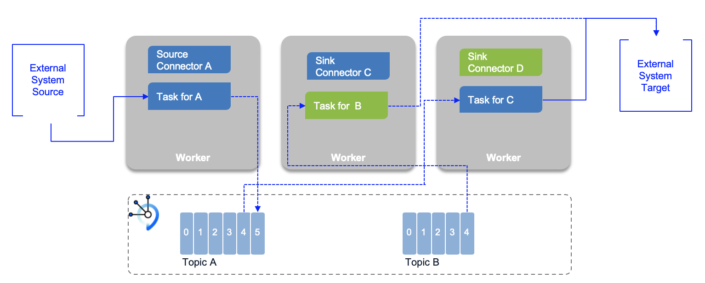
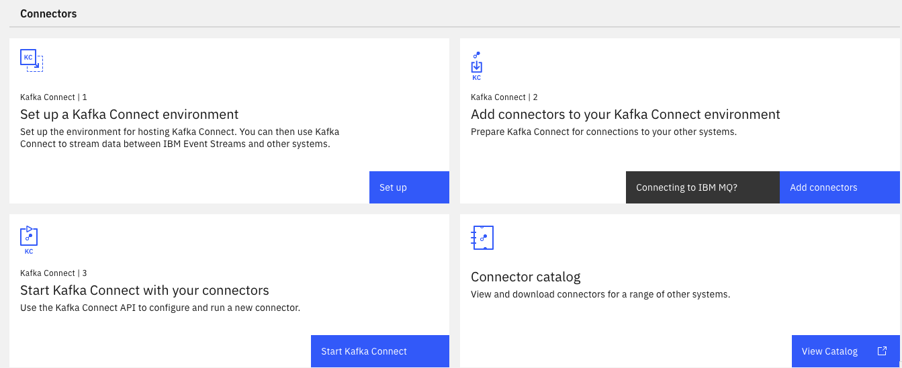

[Kafka connect](https://kafka.apache.org/documentation/#connect) is an open source component for easily integrate external systems with Kafka. It works with any Kafka product like IBM Event Streams. It uses the concepts of source and sink connectors to ingest or deliver data to / from  Kafka topics.

The general concepts are detailed in the [IBM Event streams product documentation](https://ibm.github.io/event-streams/connecting/connectors/). Here is a quick summary:

* **Connector** represents a logical job to move data from / to kafka  to / from external systems. A lot of [existing connectors](https://ibm.github.io/event-streams/connectors/) can be reused, or you can [implement your own](https://kafka.apache.org/documentation/#connect_development).
* **Workers** are JVM running the connector. For production deployment workers run in cluster or "distributed mode", and leverage the group management protocol to scale task horizontally.
* **Tasks**: each worker coordinates a set of tasks to copy data. In distributed mode, task states are saved in kafka topics. They can be started, stopped at any time to support resilience, and scalable data pipeline.
* **REST API** to configure the connectors and monitors the tasks.

The following figure illustrates a classical 'distributed' deployment of a Kafka Connect cluster. Workers are the running process to execute connectors and tasks. Workers are JVMs. Tasks are threads in a JVM. For fault tolerance and offeset management, Kafka connect uses Kafka topics (`-offsets, -config, -status`)
When a connector is first submitted to the cluster, the workers rebalance the full set of connectors in the cluster and their tasks so that each worker has approximately the same amount of work. 

* Connector and tasks are not guaranteed to run on the same instance in the cluster, especially if you have multiple tasks and multiple instances in your cluster.
* Connector coordinates data streaming by managing tasks
* The connector may be configured to add `Converters` (code used to translate data between Connect and the system sending or receiving data), and `Transforms`: Simple logic to alter each message produced by or sent to a connector.

Connector keeps state into three topics, which may be created when the connectors start are:

* **connect-configs**: This topic stores the connector and task configurations.
* **connect-offsets**: This topic stores offsets for Kafka Connect.
* **connect-status**: This topic stores status updates of connectors and tasks.

## Characteristics

* Copy vast quantity of data from source to kafka: work at the datasource level. So when the source is a database, it uses JDBC API for example.
* Support streaming and batch.
* Scale from standalone, mono connector approach to start small, to run in parallel on distributed cluster.
* Copy data, externalizing transformation in other framework.
* Kafka Connect defines three models: data model, worker model and connector model.

## Fault tolerance

When a worker fails: 

Tasks allocated in a worker that fails are reallocated to existing workers, and the task's state, offset, source record mapping to offset are reloaded from the different topics.

## Installation

The  Kafka connect framework fits well into a kubernetes deployment. We have different options for that deployment.

We recommend reading the [IBM  event streams documentation](https://ibm.github.io/event-streams/connecting/setting-up-connectors/) for installing Kafka connect with IBM Event Streams or you can also leverage the [Strimzi Kafka connect operator](https://strimzi.io/docs/0.18.0/#kafka-connect-str).

With IBM Event Streams on premise, the connectors setup is part of the user admin console toolbox:

*Deploying connectors against an IBM Event Streams cluster, you need to have an API key with Manager role, to be able to create topic, produce and consume messages for all topics.*

As an extendable framework, Kafka Connect, can have new connector plugins. To deploy new connector, you need to use the kafka docker image which needs to be updated with the connector jars and redeployed to kubernetes cluster or to other environment. With IBM Event Streams on Openshift, the toolbox includes a kafka connect environment packaging, that defines a Dockerfile and configuration files to build your own image with the connectors jar files you need. The configuration files defines the properties to connect to Event Streams kafka brokers using API keys and SASL.

The following [public IBM messaging github account](https://github.com/ibm-messaging) includes supported, open sourced, connectors (search for `connector`).

Here is the [list of supported connectors](https://ibm.github.io/event-streams/connectors/) for IBM Event Streams.

## Further Readings

* [Apache Kafka connect documentation](https://kafka.apache.org/documentation/#connect)
* [Confluent Connector Documentation](https://docs.confluent.io/current/connect/index.html)
* [IBM Event Streams Connectors](https://ibm.github.io/event-streams/connecting/connectors/) or [the list of supported connectors](https://ibm.github.io/event-streams/connectors/)
* [Our EDA Kafka connect lab for Cloud Object Storage Sink](https://ibm-cloud-architecture.github.io/refarch-eda/use-cases/connect-cos/)
* [Our EDA Kafka connect lab for Cloud Object Storage S3](https://ibm-cloud-architecture.github.io/refarch-eda/use-cases/connect-s3/)
* [MQ to kafka lab repository](https://github.com/ibm-cloud-architecture/eda-lab-mq-to-kafka)
* [Kafka Connector Sink lab for Mongodb](https://github.com/ibm-cloud-architecture/eda-lab-mongodb)
* [MongoDB Connector for Apache Kafka](https://github.com/mongodb/mongo-kafka)
