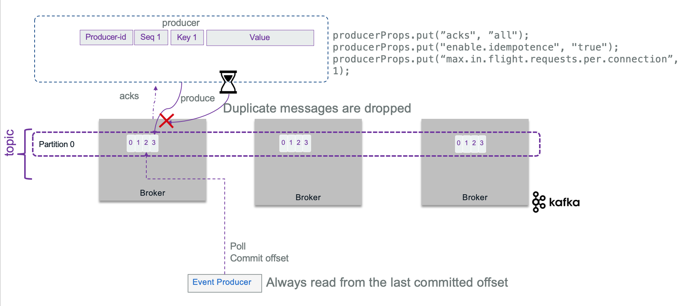
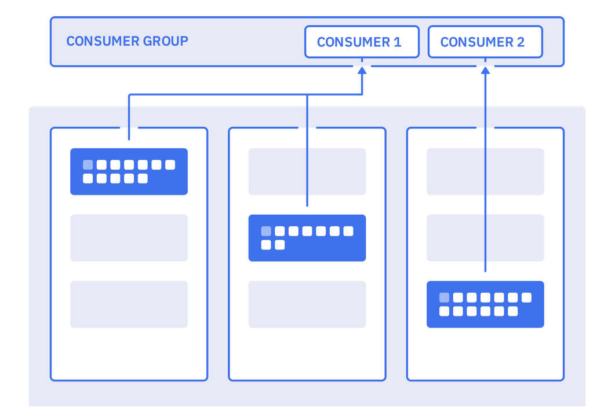
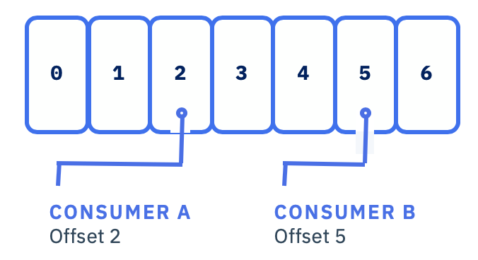
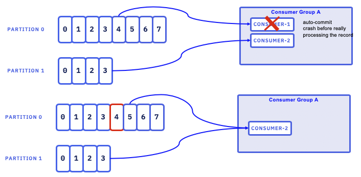

# Kafka Producers & Consumers

## Kafka Producers

A producer is a thread safe Kafka client API that publishes records to the cluster. It uses buffers, thread pool, and serializers to send data. They are stateless: the consumers is responsible to manage the offsets of the message they read. When the producer connects via the initial bootstrap connection, it gets the metadata about the topic - partition and the leader broker to connect to. The assignment of messages to partition is done following different algorithms: round-robin if there is no key specified, using the hash code of the key, or custom defined.

We recommend reading [IBM Event streams producer guidelines](https://ibm.github.io/event-streams/about/producing-messages/) to understand how producers work with its configuration parameters.

### Design considerations

When developing a record producer you need to assess the followings:

* What is the event payload to send? Is is a root aggregate, as defined in domain driven design, with value objects?  Does it need to be kept in sequence to be used as event sourcing? or order does not matter? Remember that when order is important, messages need to go to the same topic. When multiple partitions are used, the messages with the same key will go to the same partition to guaranty the order. See related discussions [from Martin Kleppmann on confluent web site](https://www.confluent.io/blog/put-several-event-types-Kafka-topic/). Also to be exhaustive, it is possible to get a producer doing retries that could generate duplicate records as acknowledges may take time to come: within a batch of n records, if the producer did not get all the n acknowledges on time, it may resend the batch. This is where 'idempotence' becomes important (see later section).
* Is there a strong requirement to manage the schema definition? If using one topic to manage all events about a business entity, then be sure to support a flexible [avro schema](https://avro.apache.org/docs/1.8.1/spec.html).
* What is the expected throughput to send events? Event size * average throughput combined with the expected latency help to compute buffer size. By default, the buffer size is set at 32Mb, but can be configured with `buffer.memory` property. (See [producer configuration API](https://Kafka.apache.org/27/javadoc/org/apache/Kafka/clients/producer/ProducerConfig.html)
* Can the producer batches events together to send them in batch over one send operation? By design Kafka producers batch events.
* Is there a risk for loosing communication? Tune the RETRIES_CONFIG and buffer size, and ensure to have at least 3 or even better 5, brokers within the cluster to maintain quorum in case of one failure. The client API is implemented to support reconnection.
* When deploying Kafka on Kubernetes, it is important to proxy the broker URLs with a proxy server outside of kubernetes. The HAProxy needs to scale, and as the Kafka traffic may be important, it may make sense to have a dedicated HAProxy for clients to brokers traffic.

* Assess *exactly once* delivery requirement. Look at idempotent producer: retries will not introduce duplicate records (see [section](#how-to-support-exactly-once-delivery) below).
* Partitions help to scale the consumer processing of messages, but it also helps the producer to be more efficient as it can send message in parallel to different partition.
* Where the event timestamp comes from? Should the producer send operation set it or is it loaded from external data? Remember that `LogAppendTime` is considered to be processing time, and `CreateTime` is considered to be event time.

### Typical producer code structure

The producer code, using java or python API, does the following steps:

* define producer properties
* create a producer instance
* Connect to the bootstrap URL, get a broker leader
* send event records and get resulting metadata.

Producers are thread safe. The send() operation is asynchronous and returns immediately once record has been stored in the buffer of records, and it is possible to add a callback to process the broker acknowledgements.

[Here is an example of producer code from the our quick start.](https://github.com/ibm-cloud-architecture/eda-quickstarts/tree/main/quarkus-Kafka-producer)

### Kafka useful Producer APIs

Here is a list of common API to use in your producer and consumer code.

* [KafkaProducer](https://Kafka.apache.org/11/javadoc/org/apache/Kafka/clients/producer/KafkaProducer.html) A Kafka client that publishes records to the Kafka cluster.  The send method is asynchronous. A producer is thread safe so we can have per topic to interface.
* [ProducerRecord](https://Kafka.apache.org/11/javadoc/org/apache/Kafka/clients/producer/ProducerRecord.html) to be published to a topic
* [RecordMetadata](https://Kafka.apache.org/11/javadoc/org/apache/Kafka/clients/producer/RecordMetadata.html) metadata for a record that has been acknowledged by the server.

### Properties to consider

The following properties are helpful to tune at each topic and producer and will vary depending on the requirements:  

 | Properties | Description |
 | --- | --- |
 | BOOTSTRAP_SERVERS_CONFIG |  A comma-separated list of host:port values for all the brokers deployed. So producer may use any brokers |
 | KEY_SERIALIZER_CLASS_CONFIG and VALUE_SERIALIZER_CLASS_CONFIG |convert the keys and values into byte arrays. Using default String serializer should be a good solution for Json payload. For streaming app, use customer serializer.|
 | ACKS_CONFIG | specifies the minimum number of acknowledgments from a broker that the producer will wait for before considering a record send completed. Values = all, 0, and 1. 0 is for fire and forget. |
 | RETRIES_CONFIG | specifies the number of times to attempt to resend a batch of events. |
 | ENABLE_IDEMPOTENCE_CONFIG | Set to true, the number of retries will be maximized, and the acks will be set to `All`.|  
 | TRANSACTION_ID | A unique identifier for a producer. In case of multiple producer instances, a same ID will mean a second producers can commit the transaction. Epoch number, linked to the process ID, avoid having two producers doing this commit. If no transaction ID is specified, the transaction will be valid within a single session.|

### How to support exactly once delivery

Knowing that exactly once delivery is one of the hardest problems to solve in distributed systems, how Kafka does it?. Broker can fail or a network may respond slowly while a producer is trying to send events.

Producer can set acknowledge level to control the delivery semantic to ensure not loosing data. The following semantic is supported:

* **At least once**: means the producer set ACKS_CONFIG=1 and get an acknowledgement message when the message sent, has been written to at least one time in the cluster (assume replicas = 3).  If the ack is not received, the producer may retry, which may generate duplicate records in case the broker stops after saving to the topic and before sending back the acknowledgement message.
* **At most semantic**: means the producer will not do retry in case of no acknowledge received. It may create log and compensation, but the message may be lost.
* **Exactly once** means even if the producer sends the message twice the system will send only one message to the consumer. Once the consumer commits the read offset, it will not receive the message again, even if it restarts. Consumer offset needs to be in sync with produced event.

At the best case scenario, with a replica factor set to 3, a broker responding on time to the producer, and with a consumer committing its offset and reading from the last committed offset it is possible to get only one message end to end.


Sometime the brokers will not send acknowledge in expected time, and the producer may decide to send the records again, generating duplicate...


To avoid duplicate message at the broker level, when acknowledge is set to ALL, the producer can also set idempotence flag: ENABLE_IDEMPOTENCE_CONFIG = true. With the idempotence property, the record sent, has a sequence number and a producer id, so that the broker keeps the last sequence number per producer and per partition. If a message is received with a lower sequence number, it means a producer is doing some retries on record already processed, so the broker will drop it, to avoid having duplicate records per partition. If the id is greater than current id known by the broker, the broker will create an OutOfSequence exception, which may be fatal as records may have been lost.



The sequence number is persisted in a log so even in case of broker leader failure, the new leader will have a good view of the states of the system.

> The replication mechanism guarantees that, when a message is written to the leader replica, it will be replicated to all available replicas.
> As soon as you want to get acknowledge of all replicates, it is obvious to set idempotence to true. It does not impact performance.

To add to this discussion, as topic may have multiple partitions, idempotent producers do not provide guarantees for writes across multiple Topic-Partition. For that Kafka supports atomic writes to all partitions, so that all records are saved or none of them are visible to consumers. This transaction control is done by using the producer transactional API, and a transactional protocol with coordinator and control message. Here is an example of such configuration that can be done in a producer constructor method:

```java
producerProps.put("enable.idempotence", "true");
producerProps.put("transactional.id", "prod-1");
KafkaProducer.initTransactions()
```

`initTransactions()` registers the producer with the broker as one that can use transaction, identifying it by its `transactional.id` and a sequence number, or epoch. Epoch is used to avoid an old producer to commit a transaction while a new producer instance was created for that and continues its work.

Kafka streams with consume-process-produce loop requires transaction and exactly once. Even committing its read offset is part of the transaction. So Producer API has a [sendOffsetsToTransaction method](https://Kafka.apache.org/27/javadoc/org/apache/Kafka/clients/producer/KafkaProducer.html#sendOffsetsToTransaction-java.util.Map-org.apache.Kafka.clients.consumer.ConsumerGroupMetadata-).

See the [KIP 98 for details.](https://cwiki.apache.org/confluence/display/Kafka/KIP-98+-+Exactly+Once+Delivery+and+Transactional+Messaging)

In case of multiple partitions, the broker will store a list of all updated partitions for a given transaction.

To support transaction a transaction coordinator keeps its states into an internal topic (TransactionLog). Control messages are added to the main topic but never exposed to the 'user', so that consumers have the knowledge if a transaction is committed or not.

See the [code in order command](https://github.com/ibm-cloud-architecture/refarch-kc-order-ms/blob/53bbb8cdeac413883ca2ccf521eb0797a43f45a3/order-command-ms/src/main/java/ibm/gse/orderms/infrastructure/Kafka/OrderCommandProducer.java#L46) microservice.

The consumer is also interested to configure the reading of the transactional messages by defining the isolation level. Consumer waits to read transactional messages until the associated transaction has been committed. Here is an example of consumer code and configuration

```java
consumerProps.put("enable.auto.commit", "false");
consumerProps.put("isolation.level", "read_committed");
```

With `read_committed`, no message that was written to the input topic in the same transaction will be read by this consumer until message replicas are all written.

In consume-process-produce loop, producer commits its offset with code, and specifies the last offset to read.

```java
offsetsToCommit.put(partition, new OffsetAndMetadata(offset + 1))
producer.sendOffsetsToTransaction(offsetsToCommit, "consumer-group-id");
```

The producer then commits the transaction.

```java
try {
    KafkaProducer.beginTransaction();
    ProducerRecord<String, String> record = new ProducerRecord<>(ApplicationConfig.ORDER_COMMAND_TOPIC, key, value);
    Future<RecordMetadata> send = KafkaProducer.send(record, callBackFunction);

    KafkaProducer.commitTransaction();
} catch (KafkaException e){
    KafkaProducer.abortTransaction();
}
```

There is an interesting [article](https://www.baeldung.com/Kafka-exactly-once) from the Baeldung team about exactly once processing in Kafka with code example which we have re-used to implement the order processing in our [Reefer Container Shipment reference application](https://ibm-cloud-architecture.github.io/refarch-kc/) and explained [here](https://ibm-cloud-architecture.github.io/refarch-kc/orders/order/)


### More readings

* [Creating advanced Kafka producer in java - Cloudurable](http://cloudurable.com/blog/Kafka-tutorial-Kafka-producer-advanced-java-examples/index.html)
* [Confluent blog: Exactly-once Semantics are Possible: Here’s How Kafka Does it](https://www.confluent.io/blog/exactly-once-semantics-are-possible-heres-how-apache-Kafka-does-it/)

## Kafka Consumers

This note includes some quick summary of different practices we discovered and studied over time. It may be useful for beginner or seasoned developers who want a refresh after some time far away from Kafka...

### Important concepts

Consumers belong to **consumer groups**. You specify the group name as part of the consumer connection parameters using the `group.id` configuration:

```java
  properties.put(ConsumerConfig.GROUP_ID_CONFIG,  groupid);
```

Consumer groups are grouping consumers to cooperate to consume messages from one or more topics. Consumers can run in separate hosts and separate processes. The figure below represents 2 consumer apps belonging to one consumer group. Consumer 1 is getting data from 2 partitions, while consumer 2 is getting from one partition.



When a consumer is unique in a group, it will get data from all partitions. There is always at least one consumer per partition.

One broker is responsible to be the consumer group coordinator which is responsible for assigning partitions to the consumers in the group. The first consumer to join the group will be the group leader. It will get the list of consumers and it is responsible for assigning a subset of partitions to each consumer

Membership in a consumer group is maintained dynamically. Consumers send hearbeats to the group coordinator broker (see configuration like [heartbeat.interval.ms](https://Kafka.apache.org/documentation/#consumerconfigs_heartbeat.interval.ms)) and `session.timeout.ms`. Partition assignement is done by different strategies from range, round robin, sticky and cooperative sticky (See [partition assignement strategy](https://Kafka.apache.org/documentation/#consumerconfigs_partition.assignment.strategy)). 

When a consumer fails, the partitions assigned to it will be reassigned to another consumer in the same group. When a new consumer joins the group, partitions will be moved from existing consumers to the new one. Group rebalancing is also used when new partitions are added to one of the subscribed topics. The group will automatically detect the new partitions through periodic metadata refreshes and assign them to members of the group. During a rebalance, depending of the strategy, consumers may not consume messages (Need Kafka 2.4+ to get cooperative balancing feature). 


Implementing a Topic consumer is using the Kafka [KafkaConsumer class](https://Kafka.apache.org/24/javadoc/?org/apache/Kafka/clients/consumer/KafkaConsumer.html) which the API documentation is a must read.

It is interesting to note that:

* To support the same semantic of a queue processing like other integration messaging systems, you need to have all the consumers assigned to a single consumer group, so that each record delivery would be balanced over the group like with a queue.
* To support pub/sub like other messaging systems, each consumer would have its own consumer group, and subscribes to all the records published to the topic.
* With `client.rack` setting a consumer can consume from a local replica, which will have better latency when using a stretched cluster.

The implementation is simple for a single thread consumer, and the code structure looks like:

* prepare the consumer properties
* create an instance of KafkaConsumer to subscribe to at least one topic
* loop on polling events: the consumer ensures its liveness with the broker via the poll API. It will get n records per poll.
* process the ConsumerRecords and commit the offset by code or use the autocommit attribute of the consumer

As long as the consumer continues to call poll(), it will stay in the group and continue to receive messages from the partitions it was assigned. When the consumer does not send heartbeats for a duration of `session.timeout.ms`, then it is considered dead and its partitions will be reassigned.

Examples of Java consumers can be found in [the order management microservice project](https://github.com/ibm-cloud-architecture/refarch-kc-order-ms/blob/master/order-command-ms/src/main/java/ibm/gse/orderms/infrastructure/Kafka/OrderEventAgent.java) under the order-command-ms folder.

We are proposing a deep dive study on this manual offset commit in [this consumer code](https://github.com/jbcodeforce/quarkus-event-driven-consumer-microservice-template) that persists events to cassandra.
Example of Javascript implementation is in [this repository/folder](https://github.com/ibm-cloud-architecture/refarch-kc-ms/blob/master/voyages-ms/server/utils/Kafka.js)

But the complexity comes from the offset management and multithreading needs. So the following important considerations need to be addressed while implementing a consumer.

### Assess number of consumers needed

The KafkaConsumer is not thread safe so it is recommended to run in a unique thread. But if needed you can implement a multi-threads solution, but as each thread will open a TCP connection to the Kafka broker, be sure to close the connection to avoid memory leak. The alternate is to start n processes (JVM process).

If you need multiple consumers running in parallel to scale horizontally, you have to define multiple partitions while configuring the topic and use fine-grained control over offset persistence. You’ll use one consumer per partition of a topic.
This consumer-per-partition pattern maximizes throughput. When consumers run in parallel and you use multiple threads per consumer you need to be sure the total number of threads across all instances do not exceed the total number of partitions in the topic.

Also, a consumer can subscribe to multiple topics. The brokers are doing rebalancing of the assignment of topic-partition to a consumer that belong to a group. When creating a new consumer you can specify the group id in the options.

### Offset management

Recall that offset is just a numeric identifier of a consumer position of the last record read within a partition. Consumers periodically need to commit the offsets they have received, to present a recovery point in case of failure. To commit offset (via API or automatically) the consumer sends a message to Kafka broker to the special topic named `__consumer_offsets` to keep the committed offset for each partition. 

Consumers do a read commit for the last processed record: 



When a consumer starts and is assigned a partition to consume, it will start at its group's committed offset or latest or earliest as [auto.offset.reset](https://Kafka.apache.org/documentation/#auto.offset.reset) (When there is a committed offset, the auto.offset.reset property is not used).

As shown in the figure below, it is possible to get duplicates if the last message processed by the consumer before crashing and committing its offset, is bigger than the last commited offset.


*Source: Kafka definitive guide book from Todd Palino, Gwen Shapira*

In the opposite, if the last committed offset is after the last processed messages and there were multiple messages returned in the poll, then those messages may be lost.


It is possible to commit by calling API or by setting some properties at the consumer creation level to enable autocommit offset [enable.auto.commit](https://Kafka.apache.org/documentation/#consumerconfigs_enable.auto.commit).

When doing manual offset commit, there are two types of approaches:

* offsets—synchronous
* asynchronous

As soon as you are coding manual commit, it is strongly recommended to implement the ConsumerRebalanceListener interface to be able to do the state modifications when the topic is rebalanced.

If a consumer fails after processing a message but before committing its offset, the committed offset information will not reflect the processing of the message. 


This means that the message will be processed again by the next consumer in that group to be assigned the partition.

Assess if it is acceptable to loose messages from topic.  If so, when a consumer restarts it will start consuming the topic from the latest committed offset within the partition allocated to itself.

As storing a message to an external system and storing the offsets are two separate operations, and in case of failure between them, it is possible to have stale offsets, which will introduce duplicate messages when consumers restart to process from last known committed offset. In this case, consumer's idempotence is needed to support updating the same row in the table, or use the event timestamp as update timestamp in the database record or use other clever solution.

As presented in the producer coding practice, using transaction to support "exactly-once", also means the consumers should read committed data only. This can be achieved by setting the `isolation.level=read_committed` in the consumer's configuration. The last offset will be the first message in the partition belonging to an open not yet committed transaction. This offset is known as the 'Last Stable Offset'(LSO).

Finally in the case where consumers are set to auto commit, it means the offset if committed at the poll() level and if the service crashed while processing of this record as: 



then the record (partition 0 - offset 4) will never be processed.

### Producer transaction

When consuming from a Kafka topic and producing to another topic, like in Kafka Stream, but also in CQRS implementation, we can use the producer's transaction feature to send the committed offset message and the new records in the second topic in the same transaction.  This can be seen as a `consume-transform-produce` loop pattern so that every input event is processed exactly once. 

An example of such pattern in done in the [order management microservice - command part](https://github.com/ibm-cloud-architecture/refarch-kc-order-ms/tree/master/order-command-ms).

### Consumer lag

The consumer lag for a partition is the difference between the offset of the most recently published message and the consumer's committed offset.

If the lag starts to grow, it means the consumer is not able to keep up with the producer's pace.

The risk, is that slow consumer may fall behind, and when partition management may remove old log segments, leading the consumer to jump forward to continnue on the next log segment. Consumer may have lost messages.


You can use the Kafka-consumer-groups tool to see the consumer lag.

### Kafka useful Consumer APIs

* [KafkaConsumer](https://Kafka.apache.org/11/javadoc/org/apache/Kafka/clients/consumer/KafkaConsumer.html) a topic consumer which support:
  * transparently handles brokers failure
  * transparently adapt to partition migration within the cluster
  * support grouping for load balancing among consumers
  * maintains TCP connections to the necessary brokers to fetch data
  * subscribe to multiple topics and being part of consumer groups
  * each partition is assigned to exactly one consumer in the group
  * if a process fails, the partitions assigned to it will be reassigned to other consumers in the same group
* [ConsumerRecords](https://Kafka.apache.org/11/javadoc/org/apache/Kafka/clients/consumer/ConsumerRecords.html) holds the list ConsumerRecord per partition for a particular topic.
* [ConsumerRecord](https://Kafka.apache.org/11/javadoc/org/apache/Kafka/clients/consumer/ConsumerRecord.html) A key/value pair to be received from Kafka. This also consists of a topic name and a partition number from which the record is being received, an offset that points to the record in a Kafka partition, and a timestamp

### References

* [IBM Event Streams - Consuming messages](https://ibm.github.io/event-streams/about/consuming-messages/)
* [KafkaConsumer class](https://Kafka.apache.org/10/javadoc/?org/apache/Kafka/clients/consumer/KafkaConsumer.html)