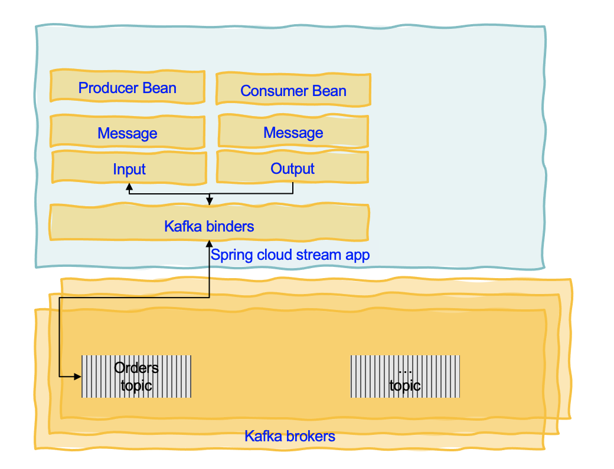
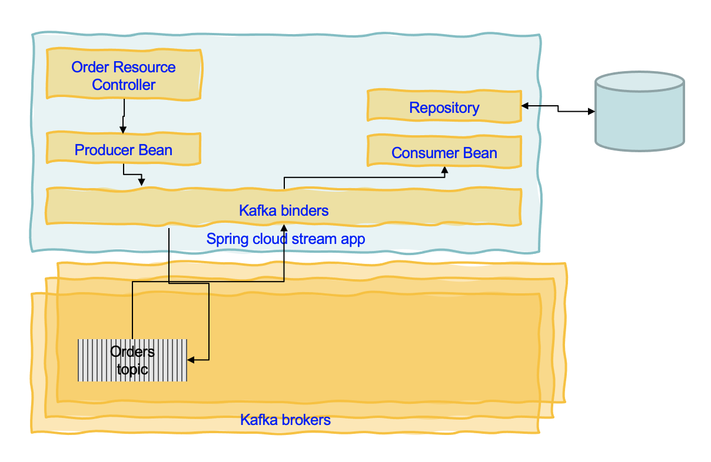

# Spring Cloud and Spring Cloud Stream

**Audience**: Developers

## Spring Cloud

[Spring Cloud](https://spring.io/projects/spring-cloud) is based on Spring boot programming model but focusing on cloud native deployment and distributed computing. As other spring boot app it includes jetty or tomcat, health checks, metrics... It supports the following patterns:

* Distributed/versioned [configuration](https://spring.io/projects/spring-cloud-config): externalize config in distributed system with config server.
* Service registration and discovery: uses Netflix Eureka, Apache Zookeeper or Consul to keep service information. 
* Routing: supports HTTP (Open Feign or  Netflix Ribbon for load balancing) and messaging (RabbitMQ and Kafka)
* Service-to-service calls: Sptring Cloud Gateway and Netflix Zuul is used
* Load balancing
* Circuit Breakers: based on Netflix Hystrix: if the request fails for n time, the circuit open.   
* Global locks
* Leadership election and cluster state
* Distributed messaging

It also supports pipelines for ci/cd and contract testing for interface validation. 

### Getting started

Use [start.spring.io](https://start.spring.io/) to create the application starting code using Kafka, Actuator, Cloud Stream or add the Spring Cloud BOM to your maven `pom.xml` file. See [the Adding Spring Cloud To An Existing Spring Boot Application section.](https://spring.io/projects/spring-cloud)

As most of the microservices expose REST resource, we may need to add the starter web:

```xml
<dependency>
    <groupId>org.springframework.boot</groupId>
    <artifactId>spring-boot-starter-web</artifactId>
</dependency>
```

We also need to install the [Spring Cloud CLI](https://cloud.spring.io/spring-cloud-cli/).

Then add the Spring cloud starter as dependency. When using config server, we need to add the config client. 

```xml
<dependency>
    <groupId>org.springframework.cloud</groupId>
    <artifactId>spring-cloud-conflig-client</artifactId>
</dependency>
```

For centralized tracing uses, starter-sleuth, and zipkin.

```xml
<dependency>
    <groupId>org.springframework.cloud</groupId>
    <artifactId>spring-cloud-starter-sleuth</artifactId>
</dependency>
<dependency>
    <groupId>org.springframework.cloud</groupId>
    <artifactId>spring-cloud-starter-zipkin</artifactId>
</dependency>
```

For service discovery add netflix-eureka-client.

```xml
<dependency>
    <groupId>org.springframework.cloud</groupId>
    <artifactId>spring-cloud-starter-eureka</artifactId>
</dependency>
```


Using the Spring Cloud CLI we can get the service registry, config server, central tracing started in one command:

```shell
spring cloud eureka configserver zipkin
```

### Spring Cloud config

Use the concept of Config Server you have a central place to manage external properties for applications across all environments.  As an application moves through the deployment pipeline from dev to test and into production you can manage the configuration between those environments and be certain that applications have everything they need to run when they migrate. 

```java
  @Value("${config.in.topic}")
  String topicName = "orders";
```

The value of the `config.in.topic` comes from local configuration or remote config server. The config server will serve content from a git. See [this sample](https://github.com/spring-cloud-samples/configserver) for such server.


## Spring Cloud Stream

[Spring Cloud Stream](https://spring.io/projects/spring-cloud-stream) is a framework for building highly scalable event-driven microservices connected with shared messaging systems. It unifies lots of popular messaging platforms behind one easy to use API including RabbitMQ, Apache Kafka, Amazon Kinesis, Google PubSub, Solace PubSub+, Azure Event Hubs, and Apache RocketMQ. 

Spring Cloud Stream is an abstraction that uses the following important concepts to supporet middleware encapsulation: **destination binders** (integration with messaging systems like Kafka or RabbitMQ), **destination bindings** (bridge code to external systems) and **message** (canonical data model to communicate between producer and consumer). 

As other Spring boot application, it uses extrernal properties to manage most of the configuration of the binders and binding.

[Spring Cloud Stream Applications](https://spring.io/projects/spring-cloud-stream-applications) are standalone executable applications that communicate over messaging middleware such as Apache Kafka and RabbitMQ. The app is using uber-jars to get the minimal required library and code The following diagram illustrates those concepts for a Spring cloud app:



**Attention** Spring Cloud Stream is not Kafka Streams or Kafka API, it is similar but it represents another abstraction. From a Kafka developer's point of view, it does not seem relevant, as why not using Kafka API and Kafka Streams API, but this is a way to encapsulate any middleware supporting pub/sub and queueing. It may be more comparable to Microprofile reactive messaging specifications and APIs, but not compatible with it. For example binding can be compared to channel of the microprofile reactive messaging constructs.

So the development decision will be around middleware abstraction and the way to simplify going from one middleware to another. Now with Kafka, because of its long retention time, it means we can have any type of consumers to read the messages at any time. Those consumers may use Kafka API (Python app or nodejs apps), in this case using the Kafka API within the Spring boot application is a better approach, as the way the abstraction is used may not be fully compatible to any Kafka consumer types.

With Kafka based application the best practice is also to define the message structure, using Avro or Protbuf, and use schema registry to ensure compatibility management between applications. To support that Spring Cloud Stream support using native (to the middleware) serialization, which in the case of Kafka could be any serdes APIs or avro API. We will cover that [in later section](#avro-serialization).


### Example of Kafka binding

The [order service spring cloud template](https://github.com/ibm-cloud-architecture/eda-quickstarts/tree/main/spring-cloud-stream) is a simple example of order service that exposes CRUD operations on the Order entity via a controller. Instead of writing to a database, this service immediately generates a message to Kafka and then the repository class consumes the message to get the data to write to the database. This is a simple way to implement 'transaction' by using the Append log of Kafka partition as a transaction log.



The way to generate code from a POST or an internal processing is to use [StreamBridge](https://github.com/spring-cloud/spring-cloud-stream/blob/master/spring-cloud-stream/src/main/java/org/springframework/cloud/stream/function/StreamBridge.java), which exposes a send function to send the record.

```java
    @Autowired
	private StreamBridge streamBridge;

    public Order processANewOrder(Order order) {
        order.status = OrderStatus.OPEN;
        order.orderID = UUID.randomUUID().toString();
        order.creationDate = LocalDate.now();
        streamBridge.send(BINDING_NAME, order);
        return order;
    }
```

As a good practice is to send a Kafka Record with a Key, which is specialy needed when sending messages to a multi partition topic: The messages with the same key will always go to the same partition. If the partition key is not present, messages will be partitioned in round-robin fashion. Spring Cloud Stream is little bit confusing as it created two concepts for partitioning: the partitionKey and the message key. The partition key is the way to support the same mechanism as Kafka is doing but for other middleware. So for Kafka we do not need to use partitionKey, but then it is important to use the message key construct. As Kafka is evolving on the partition allocation, it is recommended to do not interfere with Kafka mechanims and use the following approach:


* Provide the message key as a SpEL expression property for example in the header: 

    ```properties
    spring.cloud.stream.bindings.<binding-name>.producer.message-key-expression: headers['messageKey']
    ```

* Then in your application, when publishing the message, add a header called `kafka_messagekey` with the value set from the attribute to use as key. Spring Cloud Stream will use the value for this header to assign it to the Kafka record Key:

    ```java
     Message<Order> toSend = MessageBuilder.withPayload(order)
            .setHeader(KafkaHeaders.MESSAGE_KEY, order.customerID.getBytes())
            .setHeader(MessageHeaders.CONTENT_TYPE, MimeTypeUtils.APPLICATION_JSON).build();
        streamBridge.send(BINDING_NAME, toSend);
    ```

You can also build composite key with a special java bean class for that and use instance of this class as key.

    ```java
     CustomerCompanyKey cck = new CustomerCompanyKey(order.customerID,customer.company);
     Message<Order> toSend = MessageBuilder.withPayload(order)
            .setHeader(KafkaHeaders.MESSAGE_KEY, cck)
            .setHeader(MessageHeaders.CONTENT_TYPE, MimeTypeUtils.APPLICATION_JSON).build();
        streamBridge.send(BINDING_NAME, toSend);
    ```

The following screen shot illustrates that all records with the same "customerID" are in the same partition:


If you want to use the partition key as an alternate way to do partition allocation using Spring Cloud Stream strategy then use a partitionKey:

```properties
spring.cloud.stream.bindings.<binding-name>.producer.partition-key-expression: headers['partitionKey']
```

and then in the code:

```java
Message<Order> toSend = MessageBuilder.withPayload(order)
            .setHeader("partitionKey", order.customerID.getBytes())
            .setHeader(MessageHeaders.CONTENT_TYPE, MimeTypeUtils.APPLICATION_JSON).build();
        streamBridge.send(BINDING_NAME, toSend);
```

### Consuming message

With the last release of Spring Cloud Stream, consumers are single beans of type `Function`, `Consumer` or `Supplier`. Here is an example of consumer only.

```java
    @Bean
    public Consumer<Message<Order>> consumeOrderEvent(){
        return msg -> saveOrder(msg.getPayload());
    }
```

For thew binding configuration the name of the method gives the name of the binding:

```yaml
spring.cloud.stream:
  bindings:
    consumeOrderEvent-in-0:
      destination: orders
      contentType: application/json
      group: orderms-grp
      useNativeDecoding: true
  kafka:
    bindings:
      consumeOrderEvent-in-0:
        consumer:
          ackMode: MANUAL
          configuration:
            value.deserializer: ibm.eda.demo.infrastructure.events.OrderDeserializer
```

The deserialization is declared in a specific class:

```java
package ibm.eda.demo.infrastructure.events;

import org.springframework.kafka.support.serializer.JsonDeserializer;

public class OrderDeserializer extends JsonDeserializer<Order> {
    
}
```

In this example above as the goal is to save to the database, we should not auto commit the offset reading. So the following settings are needed on the consumer side:

```yaml
spring.cloud.stream.kafka:
    bindings:
      consumeOrderEvent-in-0:
        consumer:
          autoCommitOffset: false
          startOffset: latest
          ackMode: MANUAL
```

And the consumer code is now looking at the acknowledge header property if present or not and perform manual acknowledge once the save operation is successful.

```java
 @Bean
    public Consumer<Message<Order>> consumeOrderEvent(){
        return msg -> {
            Acknowledgment acknowledgment = msg.getHeaders().get(KafkaHeaders.ACKNOWLEDGMENT, Acknowledgment.class);
            saveOrder(msg.getPayload());
            if (acknowledgment != null) {
                acknowledgment.acknowledge();
            }
        };
```

### Kafka spring cloud stream app basic

The approach to develop such application includes the following steps:

* A spring boot application, with REST spring web starter
* Define a resource and a controller for the REST API.
* Define inbound and/or outbound binding to communicate to underlying middleware
* Add method to process incoming message, taking into account the underlying middleware and serialization. For example with Kafka, most of the consumers may not auto commit the read offset but control the commit by using manual commit. 
* Add logic to produce message using middleware 


To add a consumer from a Kafka topic for example, we can add a function that will process the message, and declare it as a Bean. 

```java
 @Bean
    public Consumer<Message<CloudEvent>> consumeCloudEventEvent(){
        return msg -> {
            Acknowledgment acknowledgment = msg.getHeaders().get(KafkaHeaders.ACKNOWLEDGMENT, Acknowledgment.class);
            saveOrder((Order)msg.getPayload().getData());
            if (acknowledgment != null) {
                System.out.println("Acknowledgment provided");
                acknowledgment.acknowledge();
            }
        };
    }
```
This previous code is also illustrating manual offset commit.

Then we add configuration to link to the binders queue or topic:

```yaml
    consumeOrderEvent-in-0:
        consumer:
          autoCommitOffset: false
          startOffset: latest
          ackMode: MANUAL
          configuration:
            value.deserializer: ibm.eda.demo.infrastructure.events.CloudEventDeserializer
```

### Avro serialization


```yaml
producer:
        useNativeEncoding: true
```